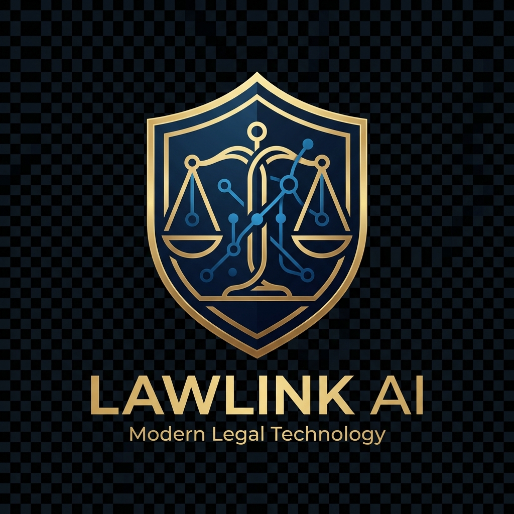

# LawLink AI — Legal Services Marketplace & Enterprise Control Console



> **"The right lawyer. Right when you need one."**

**LawLink AI** is a production-ready, full-stack legal services marketplace and legal intelligence platform designed for the Nigerian legal ecosystem (and architected for global expansion). LawLink connects verified legal practitioners, Senior Advocates of Nigeria (SAN), and law firms with individual clients and corporate enterprises.

---

## 🏛️ Platform Architecture & Key Features

### 1. 🤖 AI Legal Intake & Deterministic Matching Engine
- **4-Step Guided Legal Intake:** Interactive wizard capturing legal category, jurisdiction state, urgency level, and factual summaries.
- **6-Factor Weighted Matching:** Calculates match percentage scores (e.g. `96% Match`) based on Practice Area (30%), Location Proximity (20%), Availability (15%), Seniority/Experience (15%), Verified Ratings (10%), and Pricing (10%).

### 2. 🚨 Emergency Legal Help Network
- **Immediate Response Portal:** Instant on-call assistance for police station arrests, illegal detainment, unlawful eviction, asset seizure, and urgent court representation.

### 3. 💬 Confidential Real-Time Workspace
- **Multi-Channel Attorney-Client Privileged Environment:**
  - 💬 **Encrypted Live Chat** with real-time file sharing.
  - 🎥 **Interactive WebRTC Video Calling** with camera toggle, mic mute, and session timer controls.
  - 📞 **Encrypted Audio Session Calls**.

### 4. 💳 Paystack & Flutterwave Escrow Gateway
- **NGN Payment Methods:** Debit/Credit Cards, Direct Bank Transfer, and USSD.
- **LawLink Escrow Protection System:** Holds consultation funds safely in escrow until session completion and client authorization.
- **Automated Tax Receipts:** Printable tax invoices itemizing counsel fees, 7.5% VAT, and platform technology charges.

### 5. 📂 Case Management & Encrypted Document Vault
- **Centralized Case Desk:** Tracks active legal matters through milestone progress timelines (`INTAKE_SUBMITTED`, `LAWYER_MATCHED`, `IN_PROGRESS`, `RESOLVED`).
- **Encrypted Vault:** AES-256 TLS 1.3 encrypted document repository for tenancy agreements, C of O land title deeds, court affidavits, and NDAs.

### 6. 📜 AI Legal Document Generator
- **Nigerian Instrument Drafting Engine:**
  - 🏡 **Residential Tenancy Agreement** (Lagos State Tenancy Law compliant)
  - 💼 **Mutual Non-Disclosure Agreement (NDA)**
  - 📜 **General Power of Attorney**
  - 📝 **Statutory Affidavit of Loss / Declaration of Age**
  - ⚖️ **Pre-Action Notice & Demand Letter**
- Features fillable form parameters, instant legal preview, one-click copy, and document printing controls.

### 7. 🏢 Law Firm Portals & Corporate Retainer Plans
- **Law Firm Admin Desk:** Firm partners manage associate lawyer rosters, pooled consultation calendars, and firm escrow revenues.
- **Corporate Legal Retainers:**
  - 🚀 **Startup Growth Retainer:** ₦150,000 / month
  - 💼 **Corporate Business Retainer:** ₦350,000 / month
  - 🏛️ **Enterprise SAN Retainer:** ₦850,000 / month (Dedicated Senior Advocate of Nigeria lead counsel & 24/7 hotline).

### 8. 🛡️ Standalone Super Admin Console (`/admin`)
- **Separate Enterprise Web Application:** Dedicated control platform built with React, TypeScript, Tailwind CSS, and TanStack Query.
- **RBAC Roles:** `SUPER_ADMIN`, `VERIFICATION_ADMIN`, `FINANCE_ADMIN`, `SUPPORT_ADMIN`, `MODERATOR`, `ANALYST`.
- **Supreme Court Verification Desk:** Inspects Call to Bar SCN credentials, NBA practicing licenses, and NIN/passport IDs.
- **Financial Analytics & Audit Trail:** GMV metrics (₦85.4M GMV), lawyer bank payout disbursements, review moderation, and immutable audit logs.

---

## 🛠️ Technology Stack

| Layer | Technologies Used |
| :--- | :--- |
| **Client Frontend** | React 19, Vite 6, Tailwind CSS, Lucide Icons, Recharts |
| **Admin Console** | Next.js / Vite, TypeScript, Tailwind CSS, TanStack Query, Axios, Zod |
| **Backend API** | Node.js, Express, Vercel Serverless Functions |
| **AI Engine** | Google Gemini 2.5 Flash (Legal Statutory Grounding Corpus) |
| **CI/CD** | GitHub Actions Workflow (`.github/workflows/deploy.yml`) |

---

## 📂 Repository Structure

```
LawLink/
├── admin/                         # Standalone Enterprise Super Admin Console
│   ├── src/
│   │   ├── components/layout/    # Navigation Sidebar & Topbar
│   │   ├── features/auth/        # Admin Login & Short-lived JWT Session Management
│   │   ├── features/dashboard/   # Financial GMV & Revenue Analytics
│   │   ├── features/verification/# Lawyer Credential Review Desk
│   │   ├── features/users/       # User & Lawyer Directory
│   │   ├── features/payments/    # Escrow Settlements & Payouts
│   │   ├── features/ai/          # Matching Weights & Model Configuration
│   │   └── features/system/      # System Audit Logs & Feature Flags
│   └── package.json
│
├── server/                        # Express Node.js Backend API
│   └── index.js                   # REST Endpoints, Analytics & Escrow Logic
│
├── api/                           # Vercel Serverless Functions
│   └── chat.js                    # LawLink AI Gemini Legal Intelligence Endpoint
│
├── src/                           # Client Marketplace Application
│   ├── components/                # Modular Modals (Booking, Workspace, Vault, etc.)
│   ├── data/                      # Mock Lawyer Datasets & Practice Specializations
│   └── App.jsx                    # Root State & Action Launcher Hub
│
└── .github/workflows/
    └── deploy.yml                 # Automated CI/CD Multi-App Build Pipeline
```

---

## 🚀 Quick Start Guide

### Prerequisites
- Node.js `v20.x` or higher
- `npm` `v10.x` or higher

### 1. Clone Repository & Install Dependencies

```bash
git clone https://github.com/Omatsulijoshua/LawLink.git
cd LawLink

# Install root marketplace dependencies
npm install

# Install admin console dependencies
cd admin
npm install --legacy-peer-deps
cd ..
```

### 2. Launch Local Development Services

Run the services in separate terminal windows:

#### Terminal 1: Backend Express Server
```bash
node server/index.js
```
> Server running on `http://localhost:5000`

#### Terminal 2: Client Marketplace Application
```bash
npm run dev
```
> Client app running on `http://localhost:5173`

#### Terminal 3: Super Admin Console
```bash
cd admin
npm run dev
```
> Admin console running on `http://localhost:5174`

---

## 🔑 Default Admin Credentials

To access the Super Admin Console (`http://localhost:5174`):
- **Email:** `lawlinkllp01@gmail.com`
- **Password:** `Admin@123`

---

## ⚙️ Environment Configuration

Create a `.env` file in the root directory:

```env
PORT=5000
GEMINI_API_KEY=your_google_gemini_api_key
PAYSTACK_SECRET_KEY=your_paystack_secret_key
FLUTTERWAVE_SECRET_KEY=your_flutterwave_secret_key
```

And in `admin/.env.example`:

```env
VITE_API_BASE_URL=http://localhost:5000
VITE_APP_TITLE=LawLink Super Admin Console
VITE_ENABLE_AUDIT_LOGGING=true
VITE_DEFAULT_COUNTRY=NG
```

---

## 🧪 Production Build & CI/CD Verification

To test production bundle compilation across both applications:

```bash
# Build main client app
npm run build

# Build admin app
cd admin
npm run build
```

The GitHub Actions workflow (`.github/workflows/deploy.yml`) automatically executes these builds on every push to `main`.

---

## 🔒 Security & Data Privacy Compliance

- **NDPR & NDPA 2023 Compliant:** Data protection controls adhering to the Nigeria Data Protection Act 2023.
- **Attorney-Client Privilege:** End-to-end encrypted live chat, audio, and video workspace.
- **Audit Logs:** Immutable log trail recording every admin login, credential approval, escrow payout, and matching weight modification.

---

## 📜 License

Copyright © 2026 LawLink AI Legal Technologies LLP. All Rights Reserved.
